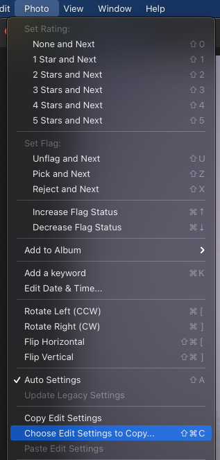
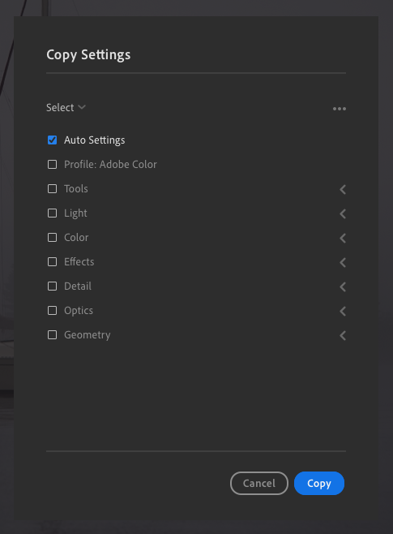
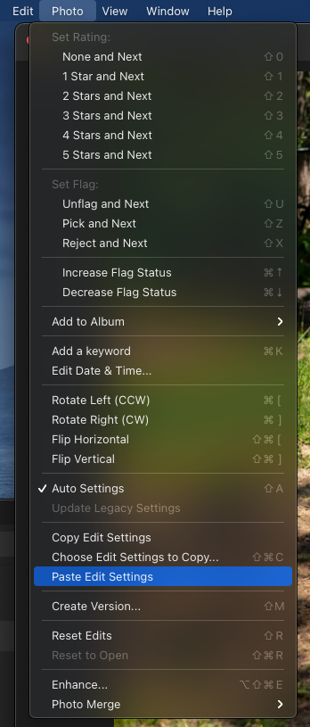

This is a relatively simple problem to solve but didn't see it posted elsewhere.
After reading this tutorial you will know how to copy and paste any settings
from one photo to many others in Adobe Lightroom CC (I'm currently on version
4.4). For this tutorial I will be using the "Auto" setting as an example but you
can copy many different settings to other photos. The screenshots will be from
my MacOS but it should work very similarly on Windows.

First select one photo and click the Auto settings button in the Edit tab.

 

Then from the Photo menu at the top, select "Choose Edit Settings to Copy..."

 

 

You can uncheck all the settings besides Auto Settings unless you want to copy
other edits you've made.

 

 

Then select ALL photos you want to copy the setting to and select the Photo
dropdown from the top again and click "Paste Edit Settings".

 

 

Note: it may take a few minutes for Lightroom to apply the settings to all the
pictures but it's a good way to bulk edit. You can see the ongoing progress in
the upper left of the application window.

Hope this was helpful to someone.
