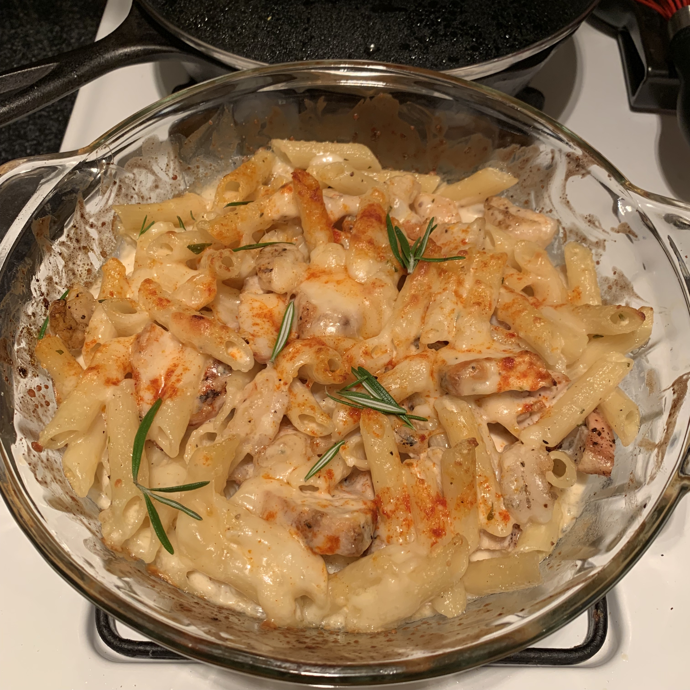

_prep time: 20min_ /
_cooking time: 10min_

This amazingly delicious pasta sauce is perfect for baked pasta dishes with shrimp or chicken
or pretty much any other pasta dish.

## Ingredients

- 3 Tbs butter
- 2 Tbs minced garlic
- 3 Tbs (or more) marsala wine
- 2 C heavy cream
- 1 C grated parmesan cheese
- 1/2 C milk
- 1/2 C chicken broth
- 1 Tbs cornstarch
- 1 Tbs Grey Poupon dijon mustard
- 2 tsp minced fresh rosemary
- 1/2 tsp salt
- 1/2 tsp minced fresh thyme
- 1/4 tsp ground cayenne pepper

## Instructions

1. Melt the butter in a medium saucepan over medium/low heat.

2. Add the garlic and sweat for about 5 minutes. Make sure it doesn't brown.

3. Add the marsala wine and cook for another 5 minutes.

4. Add the remaining ingredients and whisk until smooth.

5. Bring to a simmer and keep it there for 10 minutes whisking lightly the whole time.

6. Cover the sauce and remove from heat.

7. Pour it onto any pasta and mix it in.

8. (Optional) Place sauced pasta and whatever else you've added into an oven safe dish.
   Add more parmesan cheese and paprika on top, and bake at 500 degrees for 10 min, or until top is golden brown.

