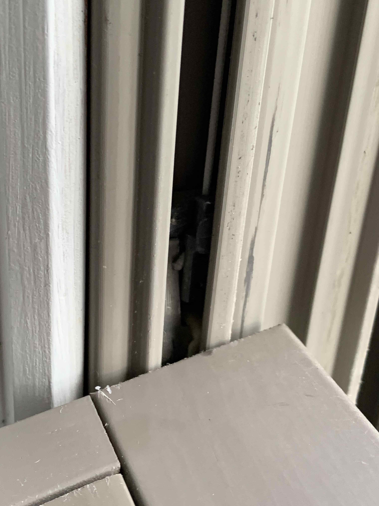

This last weekend I learned how window balancers work. My windows are Anderson
brand but I think it's similar for most other windows. The problem was the pane
continualy falling down when I tried to open them. For years I've just been
opening the top window since the bottom wouldn't stay open. I finally was able
to remove both panes, slide the little cover down to expose the balancer inside
the sash, and reconnect the string on the balancer to the balance shoe (the
thing that slides up and down that the window sash sits in). Somehow the string
had become disconnected so the spring in the balancer wasn't doing anything to
hold the windows up. It was a bit of a pain but didn't take too long. Just
surprised there was very little documentation on this online. Pretty sure I have
Anderson 400 Series Tile-Wash double hung windows.

This picture shows the string connecting to the balance shoe.

This video gives a good visual of what I'm talking about although isn't really
the problem I had. https://youtu.be/kjJ50qKMaqw
